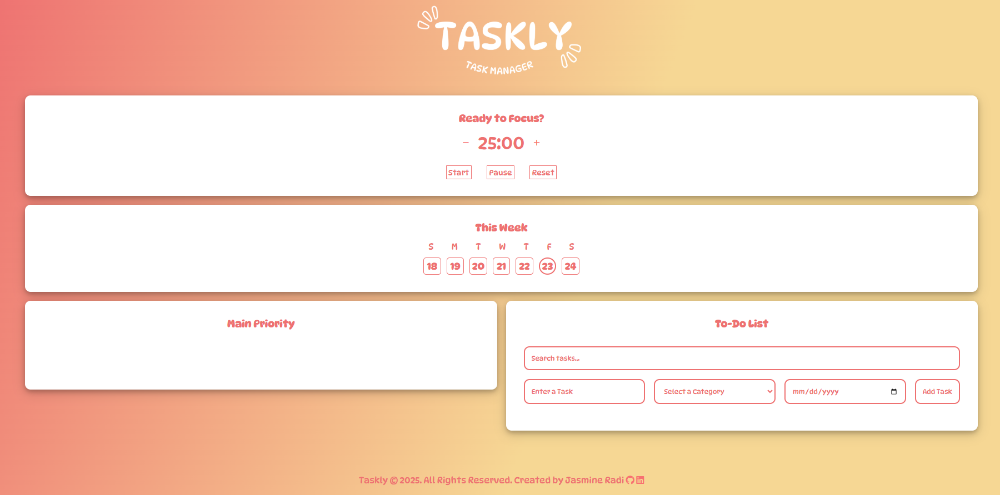

My Portfolio features projects and applications that I have used to build my skill outside of school. 

Jasmine Radi - Portfolio Site

Features: HTML, CSS, JavaScript, Responsive Design (Mobile, Tablet, Desktop)

Design elements include: The Seasons Font - Adobe Fonts, Custom Hero images and SVG graphics throughout.

Project status: 🛠️ Under Construction: Home Page | Featured Projects, Portfolio Page | All Projects

 
 
 

Taskly - Task Manager Web Application

<a href="https://tasklythetaskmanager.netlify.app">View It Live</a>

Features: HTML, CSS, JavaScript, Responsive Design (Mobile, Tablet, Desktop)

Design elements include: Dynapuff - Google Fonts, CSS gradients, Font-Awesome Icons.

Project status: ✔️ Fully Completed.

